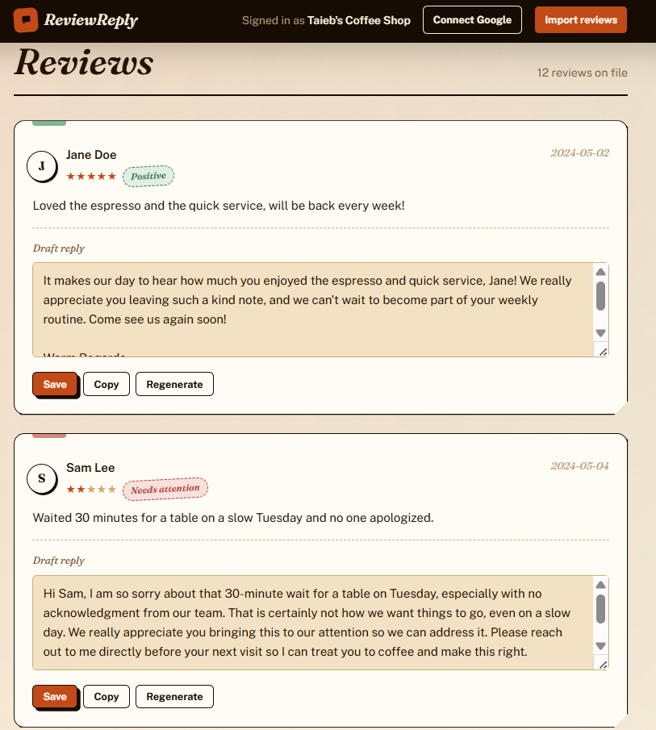

# ReviewReply

Drafts on-brand replies to Google reviews in seconds, so a business owner
always has a genuine starting point instead of a generic template. See
[docs/PLAN.md](docs/PLAN.md) for the problem this solves and
[docs/ARCHITECTURE.md](docs/ARCHITECTURE.md) for how it's built.

## Setup

```bash
python -m venv .venv
.venv\Scripts\activate        # Windows
# source .venv/bin/activate   # macOS/Linux

pip install -r requirements.txt
copy .env.example .env        # Windows; cp on macOS/Linux
```

Edit `.env` and set `GEMINI_API_KEY` to a free key from
https://aistudio.google.com/apikey.

## Run

```bash
uvicorn app.main:app --reload
```

Visit http://127.0.0.1:8000/ — you'll land on `/signup` first. Create an
account with an email and password, which signs you in and redirects to
`/setup` to create your business and voice profile, then to the dashboard.
Each account only sees the businesses it created (see "Accounts" below).
Import reviews from the dashboard's "Import reviews" link, either by
uploading a CSV (see `seed_data/sample_reviews.csv` for the expected
columns) or by pasting review text directly.

The SQLite database file (`reviewreply.db`) is created automatically on
startup in the project root.



## Accounts

Signing up (`/signup`) creates a `User` row and logs you in; `/login` and
`/logout` handle returning sessions. Passwords are hashed with
PBKDF2-HMAC-SHA256 (`app/auth.py`) — never stored or logged in plain text.
Every `Business` belongs to exactly one `User`, and all business/review/draft
routes 404 (not 403) on another account's data, so business IDs can't be
probed to confirm they exist. Visiting any page without an active session
redirects to `/login?next=<original path>`, which sends you back there after
a successful login.

If you're upgrading a database that predates accounts (rows in `businesses`
with no owner), the first person to sign up on that database automatically
adopts all ownerless businesses — no manual migration needed.

## Connecting a Google Business Profile account

Reviews can come in three ways: CSV upload, manual paste, or now a live
Google Business Profile connection (`app/sources/google_source.py`,
`app/routes/google_auth.py`). The OAuth flow, token storage, and sync are
fully implemented — what's missing is Google's approval of API access,
which is external to this app and can't be skipped (see prerequisites
below). Until that's approved, use CSV/paste as usual.

### Using it once you have credentials

1. Add `GOOGLE_CLIENT_ID`, `GOOGLE_CLIENT_SECRET`, and `GOOGLE_REDIRECT_URI`
   to `.env` (see `.env.example` — `GOOGLE_REDIRECT_URI` defaults to
   `http://127.0.0.1:8000/auth/google/callback` for local dev and must
   exactly match the redirect URI registered on the OAuth client).
2. On the dashboard, click **Connect Google** and complete the consent
   screen. This auto-selects the first Business Profile location returned
   for the account — a business with multiple locations isn't supported
   yet (no location picker).
3. Click **Sync Google reviews** any time to pull in new reviews since the
   last sync. Reviews already imported are skipped (deduped by Google's
   review ID), so it's safe to click repeatedly.
4. **Disconnect** removes the stored tokens and stops the sync option from
   showing; it doesn't delete reviews already imported.

Tokens are stored per business in the `google_connections` table
(`app/models.py`); access tokens are refreshed automatically when expired.

### 1. Prerequisites (Google's side — this is the real gate, not the code)

- The business must have a **Google Business Profile that is claimed and
  verified**, and Google generally expects it to have been active for a
  while (60+ days) before approving API access — a brand-new listing is
  likely to be rejected.
- A **Google Cloud project** to hold the OAuth credentials.
- The Business Profile APIs are **not self-serve**. You must submit
  [Google's API access request form](https://developers.google.com/my-business/content/prereqs)
  and describe the use case (owner managing replies to their own
  location's reviews). Approval is manual and typically takes several
  business days, not instant — build this lead time into any rollout plan.

### 2. Once access is approved

In the Google Cloud Console, enable the APIs Google's setup flow requires
(reviews live under the `mybusiness.googleapis.com` v4 API, but Google's
own basic-setup instructions have you enable the full family together):

- Google My Business API (this is the one with `accounts.locations.reviews.list`)
- My Business Account Management API
- My Business Business Information API
- My Business Notifications API
- My Business Verifications API
- My Business Place Actions API
- My Business Q&A API
- My Business Lodging API

Then create an **OAuth 2.0 Client ID** (Credentials → Create credentials →
OAuth client ID → Web application), with the redirect URI set to this
app's callback route — `http://127.0.0.1:8000/auth/google/callback` for
local dev, or your deployed host's equivalent. The token request must
include this scope:

```
https://www.googleapis.com/auth/business.manage
```

Add the resulting client ID/secret to `.env` — see `.env.example`.

### 3. Known limitations of the current implementation

- **Single location only**: the callback auto-connects the first Business
  Profile location returned for the account. Multi-location businesses
  would need a location-picker step added to `app/routes/google_auth.py`.
- **No CSRF nonce on the OAuth `state` param**: `state` just carries the
  business ID through the redirect round-trip. Acceptable for this MVP's
  single-owner, no-login model, but would need a signed/session-bound
  state value if multi-user auth is ever added.
- **No reply-posting back to Google**: this only pulls reviews in; replies
  are still copy-pasted by the owner (see "Out of scope for MVP" in
  [docs/PLAN.md](docs/PLAN.md)).
- **Manual sync only**: there's no scheduled/background sync — the owner
  clicks "Sync Google reviews" on the dashboard when they want fresh data.

There is no billing for the Business Profile APIs themselves — access
approval is the real gate, not cost.

## Tests

See [TESTING.md](TESTING.md).

## Publishing with Cloudflare Tunnel

This puts the app running on your own PC on the internet through a
[Cloudflare quick tunnel](https://developers.cloudflare.com/tunnel/get-started/).
It's free and needs no Cloudflare account or domain. The app keeps using
the local SQLite database, so nothing is hosted elsewhere: **your PC has to
stay on, awake, and running the script for the site to be reachable.**

### 1. Install `cloudflared` (once)

With admin rights, the simplest route is:

```powershell
winget install --id Cloudflare.cloudflared
```

Without admin rights, download Cloudflare's signed executable into your user
folder instead (`scripts/start-public.ps1` looks there automatically):

```powershell
$dir = "$env:LOCALAPPDATA\cloudflared"
New-Item -ItemType Directory -Force $dir | Out-Null
Invoke-WebRequest -UseBasicParsing -OutFile "$dir\cloudflared.exe" `
  -Uri "https://github.com/cloudflare/cloudflared/releases/latest/download/cloudflared-windows-amd64.exe"
& "$dir\cloudflared.exe" --version
```

### 2. Start it

Complete the Setup steps above first (virtual environment and `.env`), then:

```powershell
powershell -ExecutionPolicy Bypass -File scripts\start-public.ps1
```

The script starts the tunnel, waits for Cloudflare to assign an address,
then starts the app and prints something like:

```
ReviewReply is public at:  https://random-words-here.trycloudflare.com
```

Open that address from any device. Sign up for an account on it first
(see "Accounts" above) — the deployment starts with no users. Press
`Ctrl+C` to stop the app and close the tunnel. Use `-Port` if 8000 is
taken.

While running through the tunnel the session cookie is marked Secure
(`SECURE_COOKIES=true`), so log in through the public address. Logging in
at `http://127.0.0.1:8000` in the same run may not keep your session.
Set `SECRET_KEY` in `.env` if you want logins to survive a restart.

### Limits of a quick tunnel

Cloudflare offers quick tunnels for testing and sharing, not production:

- The address is random and **changes every time you start it**.
- No uptime guarantee, and no more than 200 requests in flight at once.
- Server-Sent Events aren't supported (this app doesn't use them).

### Things to know

- **Anyone with the address can sign up** and create drafts, which uses your
  Gemini API quota. Only share the link with people you trust, and stop the
  script when you're done.
- **Connect Google needs the callback registered each run.** The script
  prints a `Google OAuth callback URL`; add that exact URL to the OAuth
  client's authorized redirect URIs in Google Cloud before clicking Connect
  Google. Because it changes every run, this is only practical for testing.
- **Want a permanent address?** That needs a domain added to Cloudflare and
  a named tunnel. See Cloudflare's
  [get started guide](https://developers.cloudflare.com/tunnel/get-started/).
